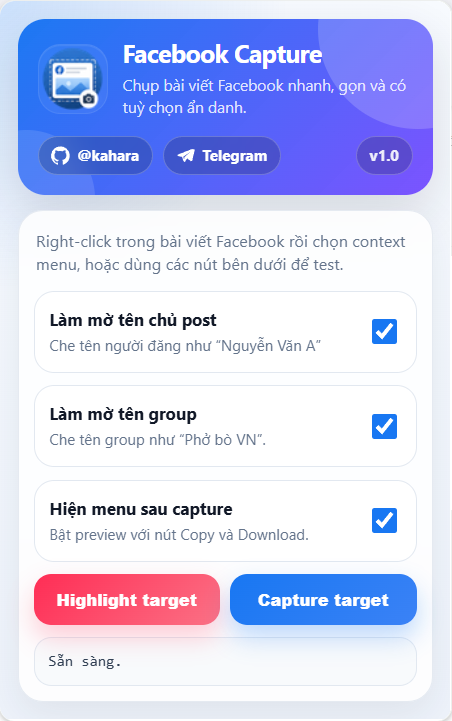
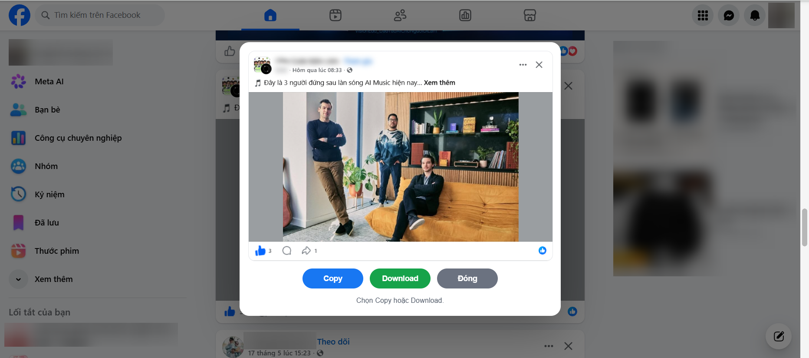

  

<h1 align="center">Facebook Post Capture</h1>

  Capture riêng bài viết hoặc modal bài viết Facebook, hỗ trợ ảnh sắc nét, làm mờ tên, tự mở nội dung rút gọn và gắn QR link bài viết.

  
  
  
  

---

## Preview

<table>
  <tr>
    <td align="center">
      <strong>Extension popup</strong>
    </td>
    <td align="center">
      <strong>Capture preview modal</strong>
    </td>
  </tr>
  <tr>
    <td align="center" width="50%">
      
    </td>
    <td align="center" width="50%">
      
    </td>
  </tr>
</table>

Popup cho phép bật/tắt các tuỳ chọn privacy, QR/link và output. Preview modal hiển thị ảnh vừa capture, link bài viết và thao tác `Copy`, `Download` hoặc `Đóng`.

## Features

- Capture đúng post hoặc post modal đang chọn trên Facebook.
- Không phụ thuộc vào class obfuscated của Facebook.
- Chụp post dài bằng cơ chế scroll-stitching kiểu GoFullPage để giữ ảnh sắc nét theo device pixel ratio.
- Copy ảnh PNG vào clipboard sau khi capture.
- Tuỳ chọn hiện modal preview với nút `Copy`, `Download`, `Đóng`.
- Preview modal hiển thị link bài viết bên dưới các nút thao tác.
- Tuỳ chọn che tên chủ post.
- Tuỳ chọn che tên group.
- Tuỳ chọn tự mở `Xem thêm` / `See more` trước khi capture.
- Tuỳ chọn tự lấy link bài viết, tạo QR và gắn vào header của post.
- Debug `Highlight target` hiển thị `Post Url <case>` để biết link được lấy từ `current`, `direct` hay `hover`.
- Toast `Đã sao chép hình ảnh` sau khi copy thành công.
- Chạy trực tiếp bằng Manifest V3, không cần build step.

## Installation

### Chrome / Cốc Cốc / Edge

1. Clone hoặc tải project này về máy.
2. Mở trang quản lý extension:
   - Chrome/Cốc Cốc: `chrome://extensions`
   - Edge: `edge://extensions`
3. Bật `Developer mode`.
4. Chọn `Load unpacked`.
5. Chọn thư mục project.
6. Mở Facebook và bắt đầu sử dụng.

## Usage

### Capture bằng context menu

1. Mở Facebook.
2. Right-click vào bài viết hoặc modal bài viết cần capture.
3. Chọn `Capture Facebook post/modal`.
4. Nếu `Hiện menu sau capture` đang tắt, ảnh sẽ được copy thẳng vào clipboard.
5. Nếu `Hiện menu sau capture` đang bật, modal preview sẽ hiện ra để chọn `Copy` hoặc `Download`.

### Capture bằng popup

1. Click icon extension trên toolbar.
2. Tuỳ chỉnh các setting cần dùng.
3. Click `Capture target`.

### Debug target

Click `Highlight target` trong popup để kiểm tra extension đang nhận diện đúng bài viết/modal nào. Output debug có thêm dòng `Post Url <case>: ...`, ví dụ:

- `Post Url current-watch`: lấy từ URL hiện tại của tab.
- `Post Url direct-group-derived`: lấy trực tiếp từ link có sẵn trong DOM và derive thành link group post canonical.
- `Post Url hover-pfbid-post`: lấy được sau khi hover timestamp để Facebook hydrate link canonical.

## Settings

| Setting | Mặc định | Mô tả |
| --- | --- | --- |
| `Làm mờ tên chủ post` | Off | Che tên người đăng bài, ví dụ người đăng trong post cá nhân hoặc post group. |
| `Làm mờ tên group` | Off | Che tên group trong post group. |
| `Hiện menu sau capture` | Off | Bật modal preview sau capture với nút `Copy` và `Download`. |
| `Tự mở Xem thêm` | Off | Click các nút `Xem thêm` / `See more` trong target trước khi capture. |
| `Gắn QR link bài viết` | Off | Tự tìm link bài viết, tạo QR và gắn vào header trước khi capture. |

## Technical notes

Phần logic chi tiết:

- [Architecture](docs/ARCHITECTURE.md)

Tóm tắt nhanh:

- Extension dùng `chrome.tabs.captureVisibleTab()` để chụp từng viewport.
- `background.js` stitch nhiều viewport lại bằng `OffscreenCanvas`, crop đúng target theo device pixel ratio.
- `content.js` chuẩn bị target, scroll đúng offset, mở `Xem thêm`, gắn QR và ẩn các tooltip/floating UI có thể che ảnh.
- Mask tên áp dụng tạm trong phiên capture rồi restore lại DOM sau khi chụp.
- Link bài viết được tìm theo nhiều case: URL hiện tại, link có sẵn trong DOM, link group/media derive, `multi_permalinks`, `story_fbid`, `pfbid`, `watch`, và fallback hover timestamp.

## Permissions

Extension sử dụng các quyền sau:

- `contextMenus`: thêm menu `Capture Facebook post/modal` khi right-click.
- `activeTab`, `tabs`, `scripting`: giao tiếp và inject content script khi cần.
- `downloads`: tải ảnh PNG khi người dùng chọn `Download`.
- `storage`: lưu setting popup.
- `clipboardWrite`: copy ảnh PNG vào clipboard.

Host permissions:

- `https://www.facebook.com/*`
- `https://web.facebook.com/*`

## Known limitations

- Facebook có thể thay đổi DOM, nên selector/marker có thể cần cập nhật theo thời gian.
- Copy ảnh vào clipboard cần browser hỗ trợ `ClipboardItem`.
- Target quá dài cần nhiều lượt capture viewport nên có thể mất thêm thời gian.
- Tự lấy link bài viết phụ thuộc vào DOM/href Facebook expose; một số post riêng tư hoặc layout mới có thể không có URL canonical.
- QR sử dụng endpoint QuickChart để tạo ảnh QR từ link bài viết.

## Disclaimer

Project này không liên kết, không được tài trợ và không được xác nhận bởi Meta/Facebook. Đây là công cụ cá nhân phục vụ capture nội dung người dùng đang xem trên trình duyệt.
